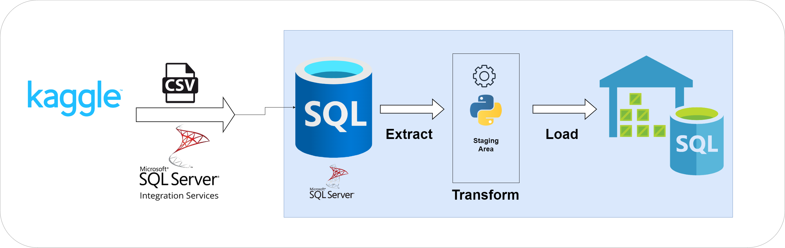
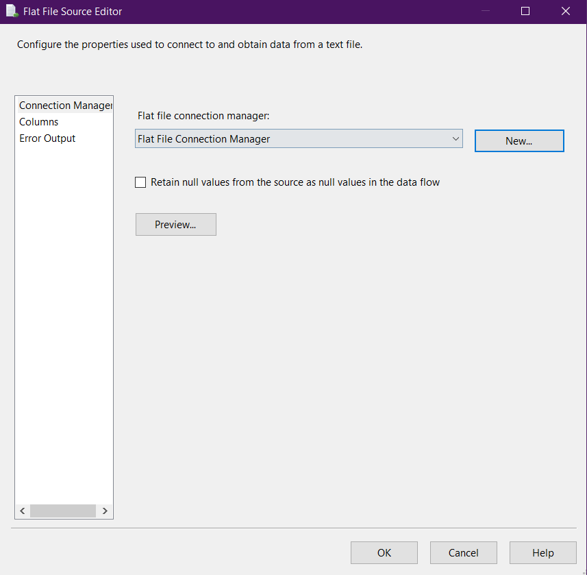
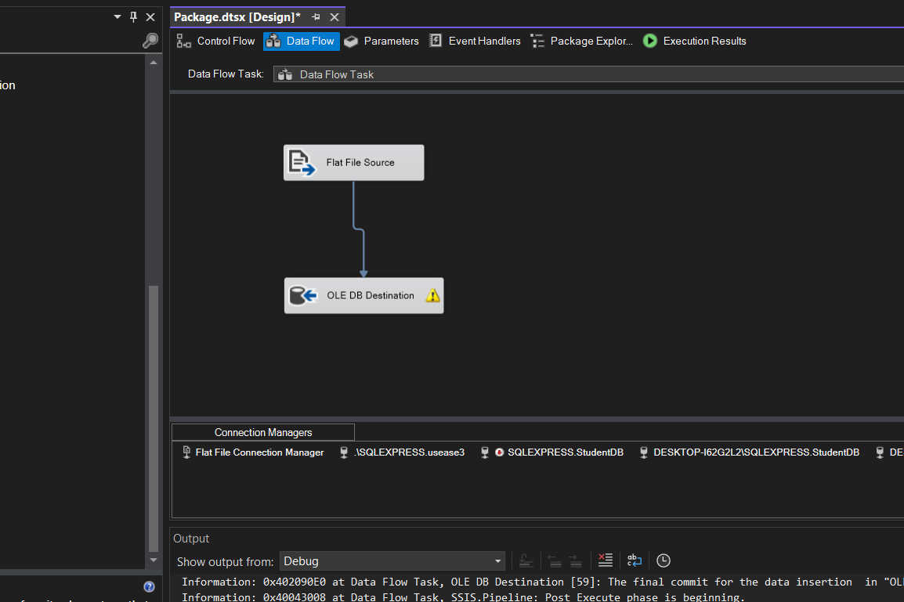
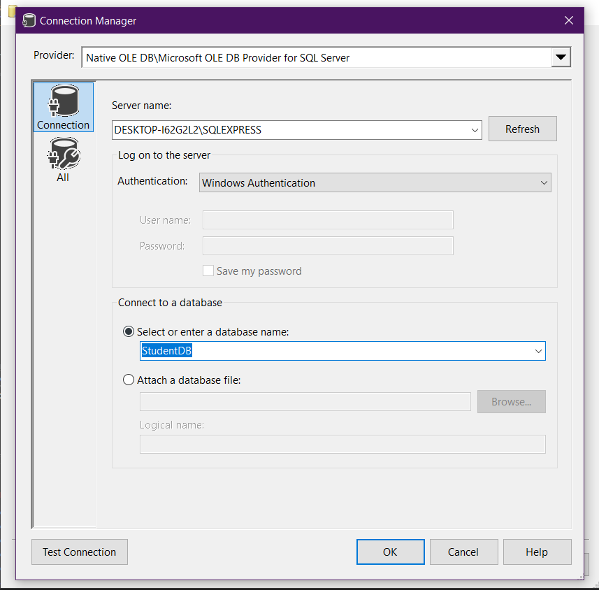
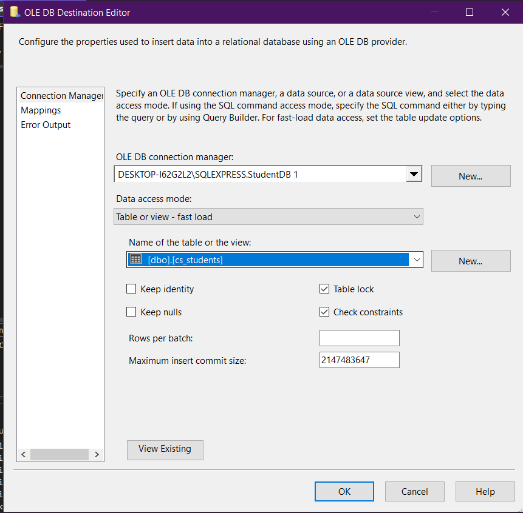
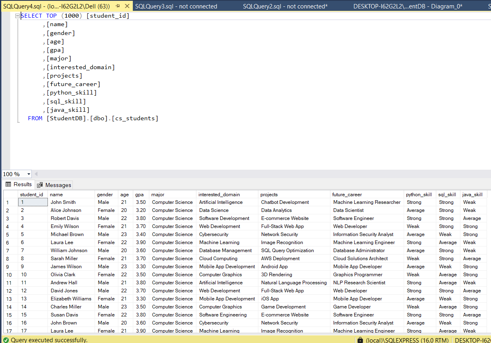

# Data Engineering Project: Computer Science Students Analysis

This project analyzes computer science student data through a comprehensive data engineering pipeline.





## Week 1: Data Management and SQL Database Setup

### Prerequisites

- Microsoft SQL Server
- SQL Server Management Studio
- Python 3.7+
- pip (Python package manager)

### Setup Instructions

1. **Clone the repository:**
   ```bash
   git clone https://github.com/MahmoudMahdy448/cs-students-career-prediction.git
   cd cs-students-career-prediction
   ```

2. **Install required Python packages:**
   ```bash
   pip install -r requirements.txt
   ```

3. **Configure the database connection:**
   - Copy the `.env.example` file to `.env`
   - Edit `.env` with your SQL Server credentials

4. **Create the database schema:**
   - Open SQL Server Management Studio (SSMS).
   - Connect to your SQL Server instance.
   - Open a new query window.
   - Copy and paste the following SQL script to create the database and table:

   ```sql
   -- Create a new database
   CREATE DATABASE StudentDB;
   GO

   -- Use the newly created database
   USE StudentDB;
   GO

   -- Create the cs_students table
   CREATE TABLE cs_students (
       student_id INT PRIMARY KEY,
       name VARCHAR(100),
       gender VARCHAR(10),
       age INT,
       gpa DECIMAL(3,2),
       major VARCHAR(50),
       interested_domain VARCHAR(100),
       projects VARCHAR(255),
       future_career VARCHAR(100),
       python_skill VARCHAR(20),
       sql_skill VARCHAR(20),
       java_skill VARCHAR(20)
   );
   ```

   - Execute the script by clicking the "Execute" button or pressing `F5`.

5. **Prepare the data:**
   - Place the `cs_students.csv` file in the `data/raw/` directory.

6. **Ingest data using SSIS:**
   - Open SQL Server Data Tools (SSDT) or Visual Studio with the SSIS extension.
   - Create a new SSIS project.
   - Drag a **Data Flow Task** to the Control Flow tab.
   - Double-click the Data Flow Task to enter the Data Flow tab.
   - Drag a **Flat File Source** to the Data Flow tab and configure it to point to your `cs_students.csv` file.
   
   - Drag an **OLE DB Destination** to the Data Flow tab and connect it to the Flat File Source.
   
   - Configure the OLE DB Destination to point to the `cs_students` table in the `StudentDB`.
   
   -- 
   -- 
   - Execute the package to ingest the data.
    

### Verifying the Setup

1. Connect to your SQL Server instance
2. Query the `cs_students` table to ensure data has been loaded:
   ```sql
   SELECT TOP 10 * FROM cs_students;
   ```

3. Run basic analysis queries (examples in `src/database/analysis_queries.sql`)

## Project Structure

